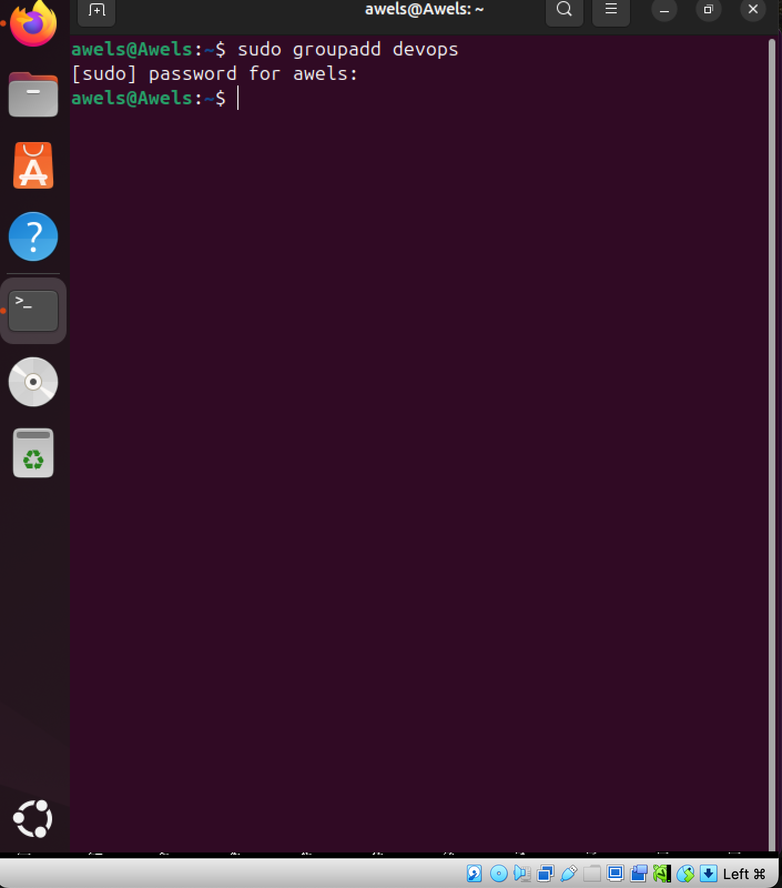
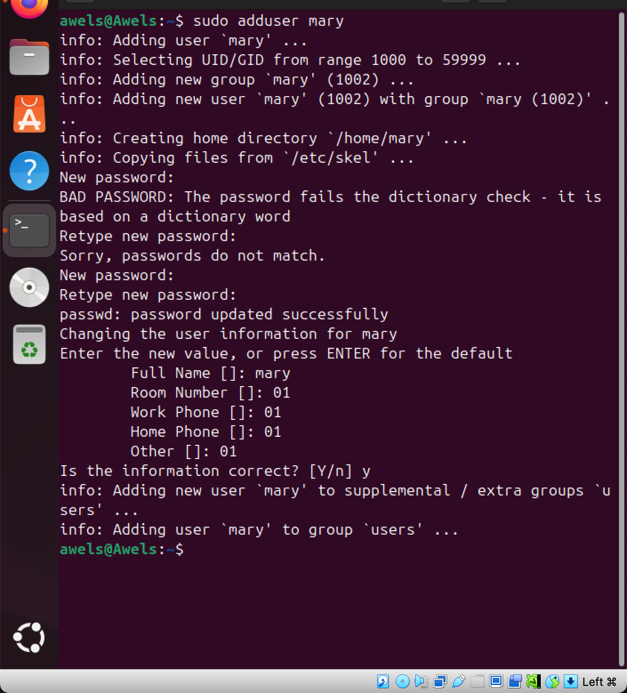
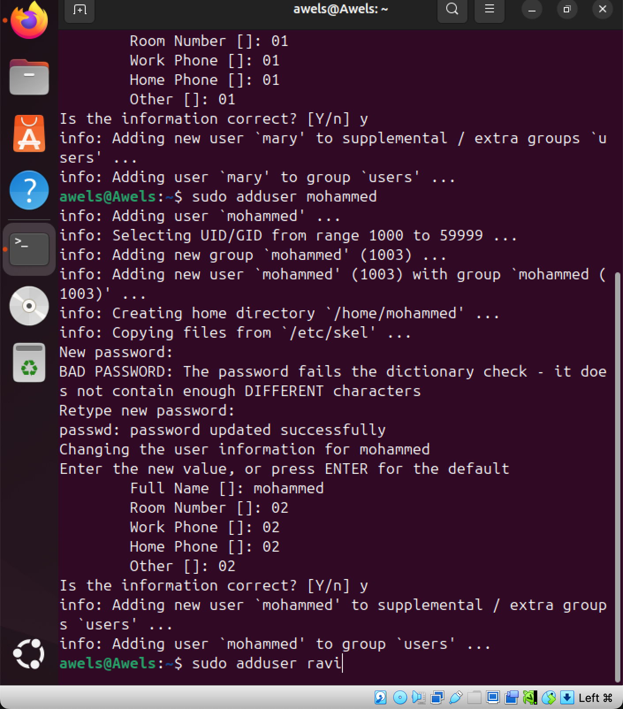
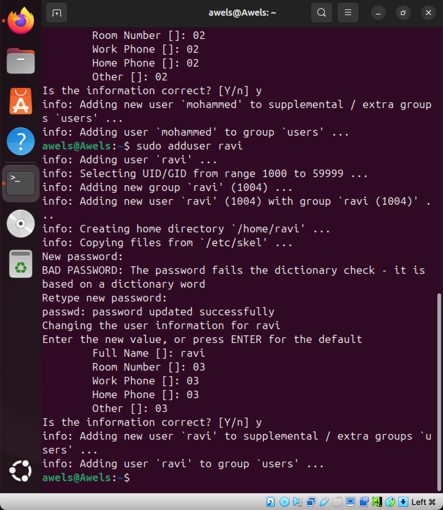
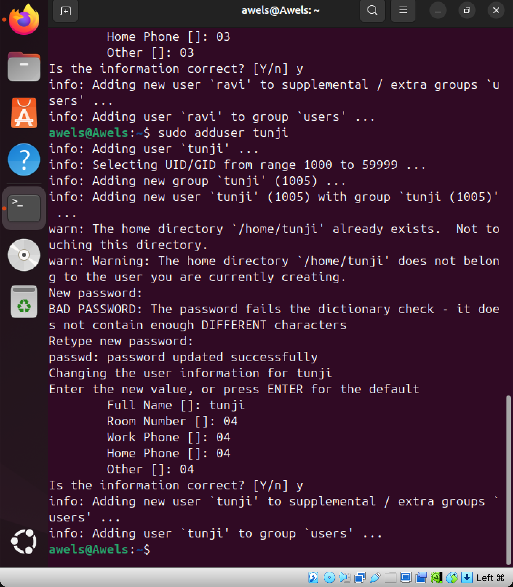
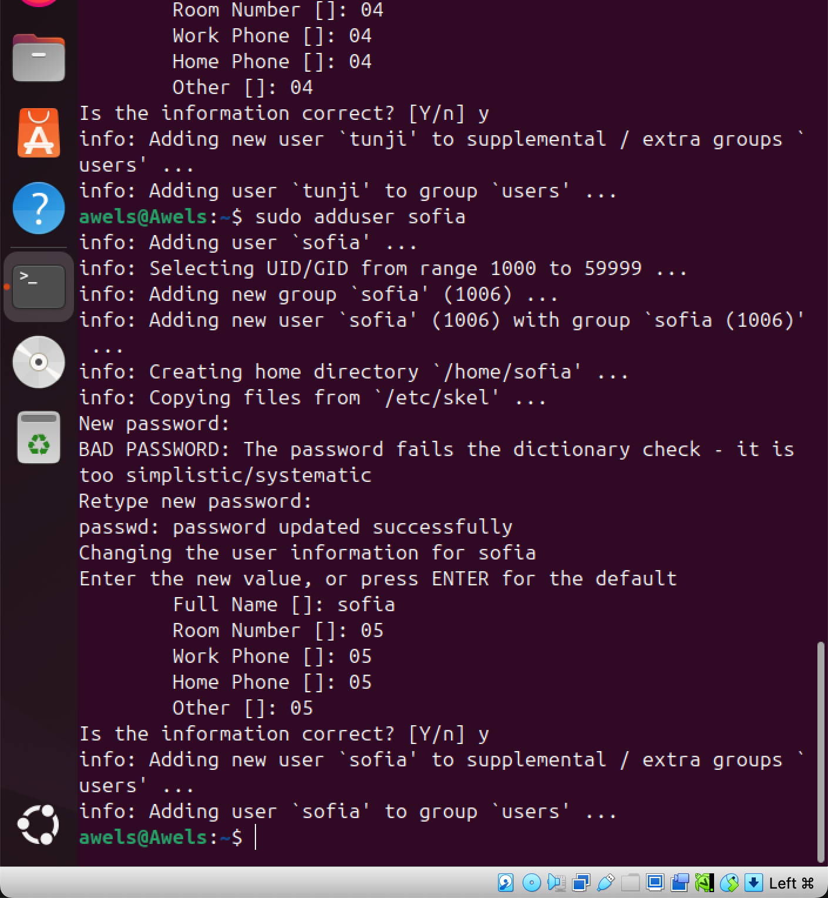
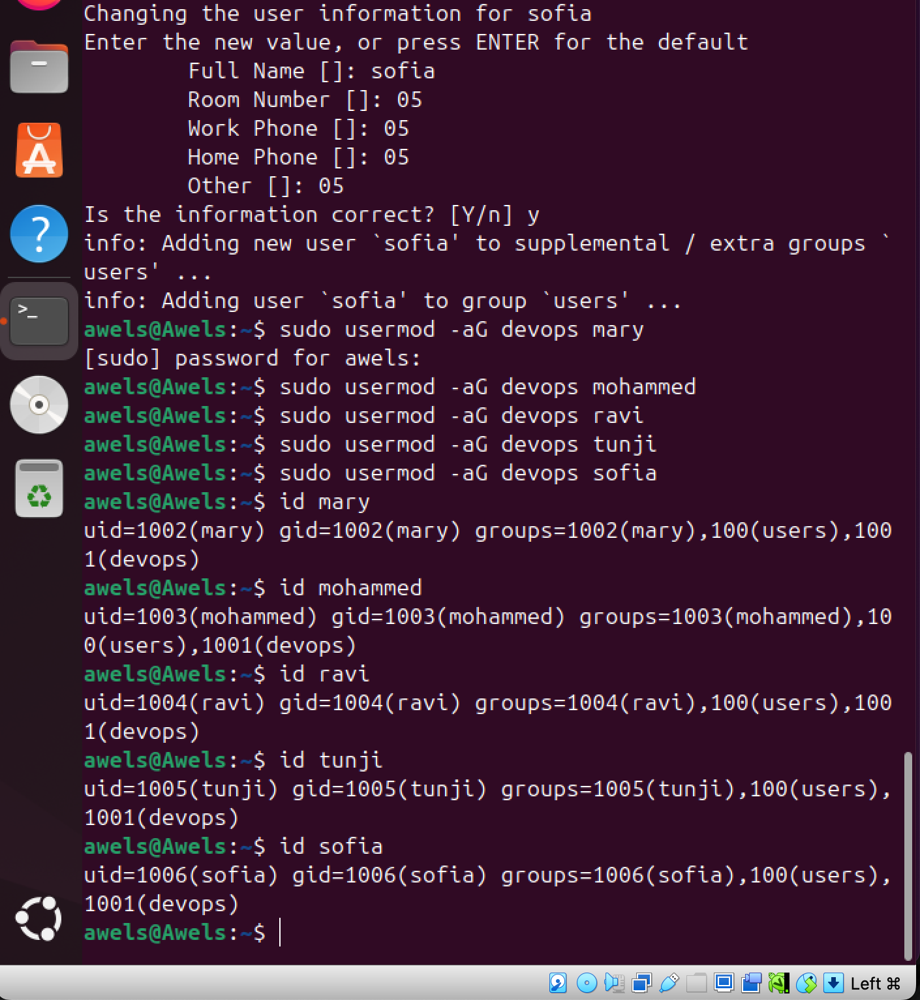
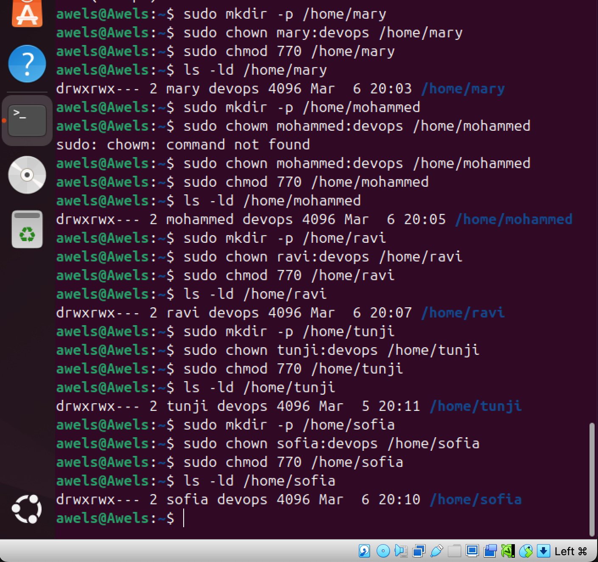

# This is a project submission for Advanve Linux Commands

In this project, I learnt differnt Linux Commands. I have mastered and advanced in my Linux commands. I learnt how to create groups and users as well as how to give them the right to either read, write or execute. 

In this task I would be practicing some of the advanced linux commands and I will also be attaching some images to record my progress. 

The first task is to create a group on the server and name it 'devops'
The command for this is 'sudo groupadd devops'

above is the picture of the first task done by me. 

## Second Task 

The next task is for me to create five users named - Mary, Mohammed, Ravi, Tunji, Sofia and ensure that each user belongs to the devops group. 
The command to add user is the 'sudo adduser mary' 'sudo adduser mohammed' 'sudo add user ravi''sudo adduser tunji' 'sudo adduser sofia'

the next thing is to ensure that each user belongs to the devops group. The command for this is 'sudo usermod -aG devops mary' 'sudo usermod -aG devops mohammed' 'sudo usermod -aG devops ravi' 'sudo usermod -aG devops tunji' 'sudo usermod -aG devops sofia'

## Third Task
Create a folder for each user in the /home directory.

# Fourt Task 
 ensure that the group ownership of each created folder belongs to devops 

 

 This is the end of my task. I have succesfully completed the task and learnt alot from the classes above and the task given. I completely understand the advance linux commands and can apply them perfectly. 